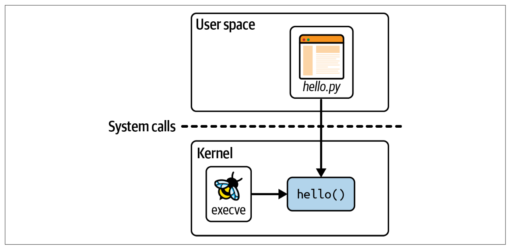
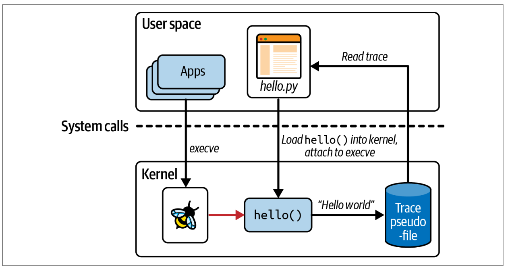

# eBPF 的你好世界！

在前一章节中，我们讨论了为什么 eBPF 如此强大，但是如果你还没感觉到你对运行 eBPF 程序意味着什么有一个具体的把握，那也没有关系。在本章中，我将使用一个简单的”你好世界“示例来让你有更好的理解。

在阅读本书时，您将了解到有几种不同的库和框架可用于编写 eBPF 应用程序。

译者: 作者将使用 [BCC Python framework](https://github.com/iovisor/bcc) 来展示如何编写 Hello World 程序，但这不是生产程序中必须的。

>   bcc: https://github.com/iovisor/bcc
>
>   安装: https://github.com/iovisor/bcc/blob/master/INSTALL.md

## BCC's "Hello World"

下面是 hello.py 的完整源代码，一个使用 BCC 库的 eBPF "Hello World" 程序：

```python
#!/usr/bin/python3  
from bcc import BPF

program = r"""
int hello(void *ctx) {
    bpf_trace_printk("Hello World!");
    return 0;
}
"""

b = BPF(text=program)
syscall = b.get_syscall_fnname("execve")
b.attach_kprobe(event=syscall, fn_name="hello")

b.trace_print()
```

代码由两部分组成：在内核运行的 eBPF 程序本身，以及把 eBPF 程序加载进内核并读取其生成的 trace 的一些用户空间代码。如图 2-1 所示，hello.py 是此程序的用户空间部分，而 hello() 是运行在内核中的 eBPF 程序。



图 2-1：”Hello World“ 的用户空间和内核组件


程序解读

第一行表明这是 Python 代码，能运行它的程序是 Python interpreter（/usr/bin/python)。

eBPF 程序本身是用 C 代码编写的：

```c
int hello(void *ctx) {
    bpf_trace_printk("Hello World!");
    return 0;
}
```

eBPF 程序所做的只是使用 `bpf_trace_printk` 的 helper 函数来打印信息。helper 函数是区分 ”extended“ 与 ”classic“ BPF 的特征之一。helper 函数是 eBPF 程序用来与系统交互的函数集。我会在第五章进一步讨论它。现在你可以简单理解它只是打印一行文本。


整个 eBPF 程序在 Python 中被定义为一个原始字符串变量 `program`。这部分 C 代码在执行前需要进行编译，但是 BCC 会自动处理（下一章节中，您会看到如何手动编译 eBPF 程序）。您所需要做的是在创建 BPF 对象时将这个字符串作为参数传递，如下所示：

```
b = BPF(text=program)
```

eBPF 程序需要附加在事件上，对于此例，我选择附加在系统调用 `execve` 上，这是用于执行程序的系统调用。在此机器上任何启动新程序时都会调用 `execve()`, 并将触发 eBPF 程序。虽然 ”execve()“ 在 Linux 中是标准接口，然而具体实现的函数名则取决于 CPU 架构。不过 BCC 为我们提供了一种便捷的方式来查询当前机器上的函数名：

```
syscall = b.get_syscall_fnname("execve")
```

`syscall` 代表我们要附加的内核函数名，使用 kprobe （第一章节介绍），将 hello 函数附加到事件：

```
b.attach_kprobe(event=syscall, fn_name="hello")
```

至此, eBPF 程序被加载进内核并附加在一个事件上，在这台机器上任何可执行文件的启用都将触发该 eBPF 程序。Python 代码中剩下要做的就是读取内核输出的追踪并将其打印到屏幕上：

```
b.trace_print()
```

`trace_print()` 函数会无限循环（直到程序停止，比如 Ctrl+C）输出追踪。


图 2-2 演示了实例代码。Python 程序编译 C 代码，加载进内核并附加到 `execve` 系统调用 kprobe。每当这台（虚拟）机器上的任何应用调用 `execve()` 时，都会触发 eBPF `hello()` 程序，将一行追踪写到特定的伪文件（伪文件会在稍后的章节介绍）。Python 程序从伪文件读取追踪信息并显示。



图 2-2 运行中的”Hello World“ 


## 运行 ”Hello World“

略


```
$ hello.py
b'     bash-5412    [001] .... 90432.904952: 0: bpf_trace_printk: Hello World'
```


一旦 eBPF 程序 `hello` 被加载并附加到一个事件上，它就会被由 preexisting processes 产生的事件触发。这帮我们回顾在第一章中学到的一些知识点：

-   eBPF 程序可以动态地改变系统的行为。不需要重启系统或者重启进程。eBPF 代码一旦附加到事件上就会立刻生效。
-   不需要为了使应用对 eBPF 可见而对应用做任何修改。（略）


程序打印的追踪不止只有 ”Hello World“ 字符串，还包含触发 eBPF 程序 hello 运行的事件的一些附加上下文信息。在本节开头的输出示例中，执行 execve 系统调用的进程 id 是 5412，它正在运行 bash 命令。对于 trace 消息，上下文信息被添加为内核追踪基础设施的一部分（它不是 eBPF 专有的）。  稍后你将会在本章中看到在 eBPF 程序中也可以获取上下文信息。

你可能会想知道 Python 代码如何知道从哪里读取追踪输出。答案并不复杂——内核中的 `bpf_trace_printk()` helper 函数总是把输出发送到位于 /sys/kernel/debug/tracing/trace_pip 的伪文件。你可以通过 cat 命查看其内容来确认这点，需要 root 权限。

对于简单的 “Hello World” 示例或用于基本调试目的，单个 trace pipe 文件很好，但它非常有限。输出格式的灵活性很小，而且它只支持字符串的输出，因此对于传递结构化的信息不是很有用。也许最重要的是，在（虚拟）机器上只有这一个位置。如果你有多个 eBPF 程序同时运行，它们都会把跟踪输出写到同一个 trace 管道中，这可能会让操作人员感到非常困惑。

从 eBPF 程序获取信息的一个更好的办法是：使用 eBPF 映射。

